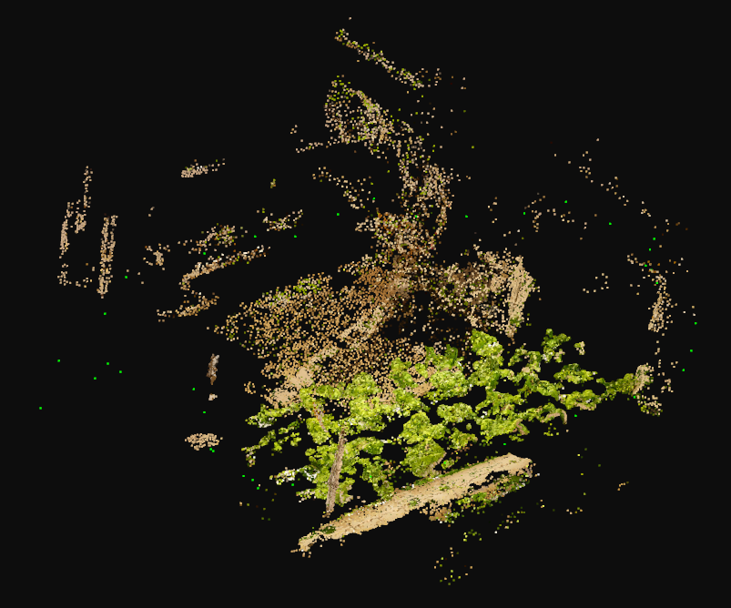
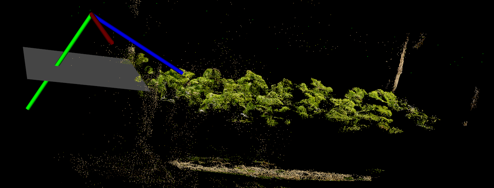
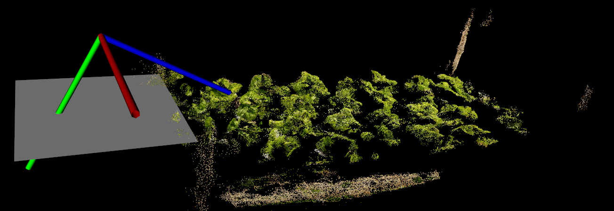
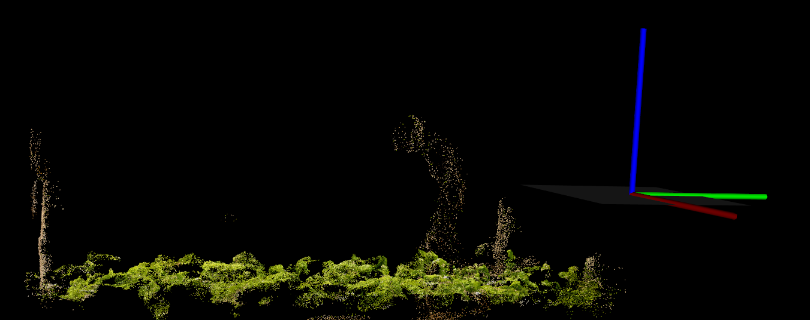
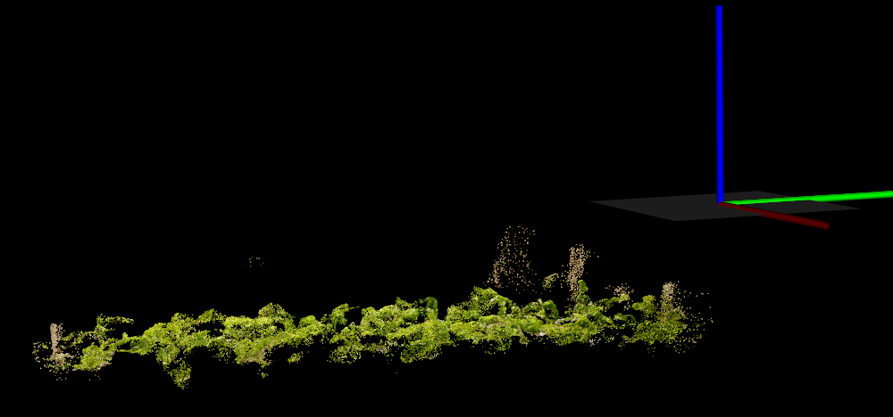
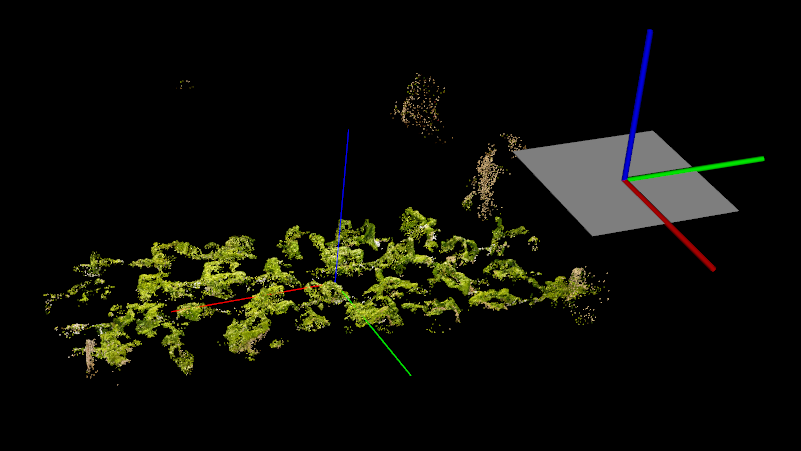
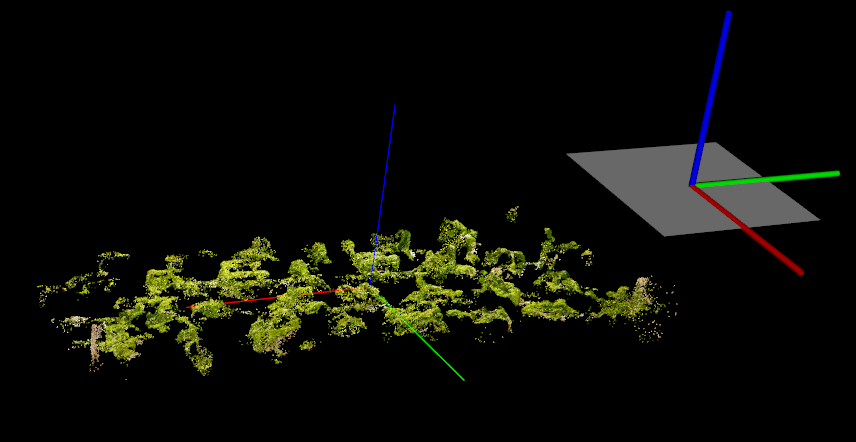
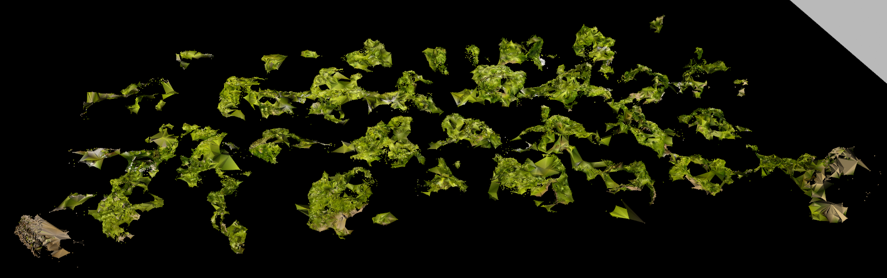
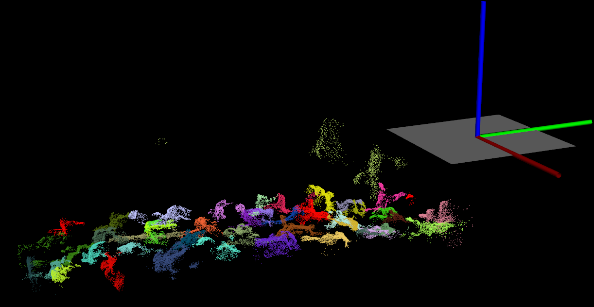
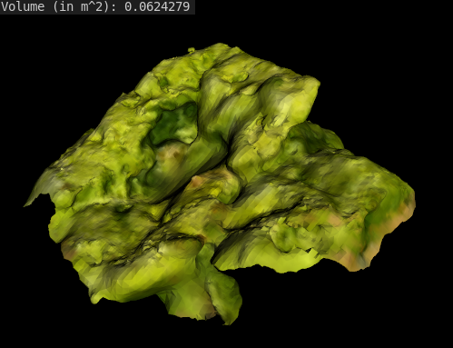

# PCL for plants

Currently developing the algorithm.

### My contribution:
- Object Oriented Approach to apply libraries of Point Cloud Library.
- Apply Geometry to analyze point cloud

## === main.cpp ===

## Step 1. Load and Visualize the source file

## Step 2. Segment XY-plane

## Step 3. Remove Outlier

## Step 4. Rotate point cloud and align Z-axis

## Step 5. Passthrough_Z

## Step 6. Compute Principal Axis

## Step 7. Passthrough_X

## Step 8. Greedy Meshing

## Step 9. Regional Growing Color Segmentation

## === compute_area.cpp ===

## Compute Volume Of Mesh

Theories and progress are in [Here](https://zesty-diagnostic-d99.notion.site/Point-Cloud-Library-82907376be92423da826b1efb5fd979d)